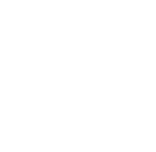
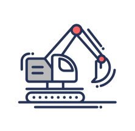

<section class="section intro">

  

  # Open source decentralized platform for cross-game digital asset exchange

  [GET WHITELISTED](https://goo.gl/forms/nWaCLnXFqjoZSxn02)
  [WHITEPAPER](https://goo.gl/forms/lvrgRCfZNuyEQlCF2)

  <!-- Hyperloot is an open-source platform that turns in-game items into crypto-assets backed by tokens.
  It's build around a proven tech stack utilizing the most proven standards.
  We are creating a gamer community-driven platform
  to interact with developers as a Hyperloot DAO. -->

</section>

<section class="section solution">

  ## HyperLoot Open Protocol Solution
  <!-- Backing in-game items with tradeable tokens, empowering peer-to-peer cross-game trading through a marketplace. -->

  

  * Ethereum
  * Marketplace & wallet
  * Alchemy protocol & Client API
  * Games & apps

  

  

  * Hyperloot utilizes Ethereum blockchain as a proven and reliable infrastructure
  * Marketplace and wallets – a place where assets are stored and can be exchanged.
  * Protocol – a set of smart contracts that defines token and asset emission rules
  * Hyperloot SDK is an interface that connects any game with an inventory to  the platform!

  

</section>

<section class="section details">
  

  
  ## Create
  Multiple crypto-secured assets starting with in-game purchases all the way to user accounts.

  

  

  
  ## Trade
  Any asset you got! A unified profit pool with an open economy will regulate prices for well-demanded items.

  

  

  
  ## Promote
  Any way you can imagine. A better-than-free model where you utilize your own items to cross-promote within the community.

  

</section>

<section class="section benefits">

  

  

  ## Built for gamers

  Forever direct ownership of what you paid for. Open and accessible trading inside or between games. Connect, trade and profit with an all-gamer community

  

  

  

  ## With developers in mind

  Easy and quick to adopt without changing your code. Convert in-game items into crypto-protected assets. Join DAO and attract investments to develop your game

  

</section>

<section class="section started">

## Get Started...

  

  ###  Newbies
  Learn how to buy, sell and store HLPT tokens, or get involved with the [HyperLoot community](https://discord.gg/qEH8PHk)

  

  

  ###  Developers
  Take a look at what we’re working on. Join [GitHub](https://github.com/HyperLootProtocol) to learn more.

  

  

  ###  Miners
  Earn HyperLoot tokens by joining the decentralised [HyperLoot network](https://discord.gg/qEH8PHk)

  

  

  ###  Foundation
  If you would like to get involved, or would simply like to support the team, there are handful of options at your disposal.
  [Contact us!](mailto:alex@hyperloot.com)

  

</section>
